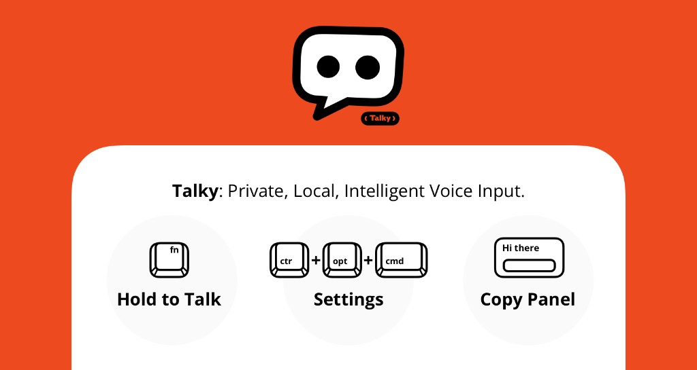

# Talky



Talky is a local-first voice input assistant optimized for macOS (Apple Silicon).  
It captures voice with a hold-to-talk workflow, runs ASR + LLM locally, and outputs polished text into the active app.

## Quick Start on macOS

Prerequisites (install manually first):
- Python 3
- Ollama (https://ollama.com/download)

1. Open Terminal in the project root.
2. Run `chmod +x start_talky.command` (first time only).
3. Run `./start_talky.command` (or double-click it in Finder).
4. Hold hotkey to talk; release to get cleaned text pasted automatically.

### Optional: Dock launcher (.app)

For a better one-click experience, wrap the script as `Talky Launcher.app`
with Script Editor / Automator, then pin it to Dock and apply a custom icon.

**First-Run Language:** [English](#first-run-guide-en) | [中文](#首次安装与权限引导中文)

## First-Run Guide (EN)

### Checklist

Before launching Talky, make sure these are ready:
- Python 3 is installed
- Ollama is installed and available in Terminal
- A compatible local Ollama model is pulled (user-selected)

Quick checks:
```bash
python3 --version
ollama --version
ollama list
```

If your model is not listed yet:
```bash
ollama pull <your-model>
```

Talky uses your configured model in `~/.talky/settings.json` (`ollama_model`).
If no model is configured yet, `start_talky.command` will use the first model
already available in your local `ollama list`.

### Download Speed Tip (Hugging Face)

If you see:
`Warning: unauthenticated requests to the HF Hub ...`

it means the download is anonymous and may be rate-limited (especially on the
first Whisper model download, which is large).

Optional acceleration:
1. Create a Hugging Face access token
2. Export token before downloading:
   ```bash
   export HF_TOKEN=your_token_here
   ```
3. Re-run:
   ```bash
   python download_model.py
   ```

You can also try a more stable/faster network and avoid interrupting the first
download.

### Permissions (Required on first run)

Talky needs two macOS permissions:
1. Microphone  
   `System Settings -> Privacy & Security -> Microphone`
2. Accessibility  
   `System Settings -> Privacy & Security -> Accessibility`

Without these permissions, recording or auto-paste may fail.

### 60-Second First Run

1. Open Terminal in the project root
2. Run `chmod +x start_talky.command` (first time only)
3. Run `./start_talky.command`
4. Hold hotkey to speak, release to process
5. Confirm output is pasted into the focused input box

If no focus target is detected, Talky shows a floating copy panel.

### Troubleshooting: Download Interrupted or Warm-up Failed

Symptom:
- Whisper warm-up fails with errors like `Input must be a zip file...`

Cause:
- `local_whisper_model` exists, but model files are incomplete (download interrupted).

Fix:
```bash
rm -rf local_whisper_model
source .venv/bin/activate
python download_model.py
./start_talky.command
```

If Ollama warm-up returns `502`, restart Ollama service:
```bash
pkill ollama
ollama serve
```

## 首次安装与权限引导（中文）

### 准备清单

启动 Talky 前，请先确认：
- 已安装 Python 3
- 已安装 Ollama，且可在 Terminal 中直接调用
- 已拉取一个你自行选择的兼容本地 Ollama 模型

快速检查命令：
```bash
python3 --version
ollama --version
ollama list
```

若 `ollama list` 中还没有目标模型，请先拉取：
```bash
ollama pull <your-model>
```

Talky 会优先使用 `~/.talky/settings.json` 中配置的 `ollama_model`。
若尚未配置模型，`start_talky.command` 会自动使用你本机 `ollama list`
里已存在的第一个模型。

### 下载速度提示（Hugging Face）

如果看到：
`Warning: unauthenticated requests to the HF Hub ...`

表示当前是匿名下载，可能被限速（首次 Whisper 模型下载体积较大）。

可选加速方式：
1. 在 Hugging Face 创建 Access Token
2. 下载前设置环境变量：
   ```bash
   export HF_TOKEN=你的token
   ```
3. 重新执行：
   ```bash
   python download_model.py
   ```

也可以更换更稳定/更快的网络，并尽量避免中途中断首次下载。

### 首次权限（必须）

Talky 首次使用需要两个 macOS 权限：
1. 麦克风  
   `系统设置 -> 隐私与安全性 -> 麦克风`
2. 辅助功能  
   `系统设置 -> 隐私与安全性 -> 辅助功能`

若未授权，录音或自动粘贴可能失败。

### 60 秒首启流程

1. 在项目根目录打开 Terminal
2. 首次执行 `chmod +x start_talky.command`
3. 执行 `./start_talky.command`
4. 按住热键说话，松开后处理
5. 确认文本已粘贴到当前聚焦输入框

若没有可用焦点，Talky 会显示悬浮复制面板。

### 故障排查：下载中断或预热失败

现象：
- Whisper 预热报错（例如 `Input must be a zip file...`）

原因：
- `local_whisper_model` 目录存在，但模型文件不完整（下载中断）。

处理：
```bash
rm -rf local_whisper_model
source .venv/bin/activate
python download_model.py
./start_talky.command
```

若 Ollama 预热报 `502`，可先重启 Ollama 服务：
```bash
pkill ollama
ollama serve
```

## Core Flow

1. Hold hotkey to record
2. Release to transcribe (ASR)
3. Clean and structure text (LLM)
4. Paste to focus target, or show floating copy panel if no focus is available

## History Logging

Every generated output is appended to a daily markdown file:

- `history/YYYY-MM-DD.md`

## Vision

**Vision Language:** [English](#vision-en) | [中文](#vision-cn)

### Vision En

#### Why Talky?

Ideas often move faster than our fingers can type.

While there are many excellent voice input tools available, we have always craved a purer, more private, and highly controllable local solution for our high-frequency daily coding and writing. Cloud-based products raise privacy concerns, and native local dictation often results in raw text filled with filler words ("um", "uh") that take more time to edit than type.

Talky is not trying to reinvent the wheel. It aims to seamlessly stitch powerful open-source AI models (ASR + LLM) into the daily macOS workflow, serving as a quiet, private, and understanding local assistant.

### 🛡️ Privacy First

Your inspiration belongs to you. Talky's entire workflow relies purely on your device's compute. No cloud APIs, no subscriptions, no data uploads, letting you record with peace of mind in any network environment.

### 🧠 Speech-to-Intent

Standing on the shoulders of giants, Talky does not just "listen" - it helps you "think" using compatible local LLMs selected by the user. It silently cleans up filler words, corrects grammar, and structures logic in the background, striving to paste clean, decent, and ready-to-use text.

### ⚡ Seamless Hold-to-Talk

Returning to the most natural "hold to speak, release to process" logic. The generated result is accurately and automatically pasted into your currently focused editor or chat window. Lost focus accidentally? Talky gracefully summons a floating copy panel to ensure not a single word you say goes to waste.

### 📝 Silent Archiving

Every flash of thought has value. Talky automatically appends all generated text to a daily-archived local Markdown file (`history/YYYY-MM-DD.md`). It is not just a cross-app input "peripheral", but also a convenient daily memo for your thoughts.

Talky is simply a starting point for exploring the potential of local AI, dedicated to making the journey from "thought" to "expression" just a little bit smoother.

### Vision Cn

#### 为什么做 Talky？

我们的想法总是比敲击键盘的手指快。

市面上已经有许多优秀的语音输入工具，但在日常高频的开发和写作中，我们始终渴望一个更纯粹、更私密、且高度可控的本地化方案。云端产品让人担忧数据隐私，而原生的本地听写又往往充斥着无意义的口语瑕疵，后期修改成本极高。

Talky 并非想要重新发明轮子，而是致力于将强大的开源 AI 模型（ASR + LLM）无缝缝合进 macOS 的日常输入流中，做一个安静、私密且懂你的本地辅助工具。

### 🛡️ 本地与隐私优先

你的灵感属于你自己。Talky 的整个工作流完全依赖你设备上的算力运行。没有云端 API，没有订阅，没有数据上传，让你在任何网络环境下都能安心记录。

### 🧠 意图级的文本梳理

Talky 站在巨人的肩膀上，不仅负责“听”，更借助用户自行选择的兼容本地大模型帮你“想”。它会在后台静默清理冗余的语气词、修正语法并梳理逻辑，力求在粘贴时提供一份干净、得体、直接可用的文本。

### ⚡ 极简的交互直觉

回归最自然的“按住说话，松开处理”逻辑。生成的结果会自动精准粘贴到你当前聚焦的编辑器或聊天窗口。如果不小心切走了焦点？Talky 会贴心地唤起一个悬浮复制面板，确保你的任何一次发音都不会白费。

### 📝 静默的历史归档

每一次闪现的想法都有其价值。Talky 会将所有生成的文本自动追加到按天归档的本地 Markdown 文件中（`history/YYYY-MM-DD.md`）。它不仅是一个跨应用的输入“外设”，也顺便成了你每日思考的备忘录。

Talky 只是一个探索本地 AI 潜力的起点，致力于让“思考”到“表达”的过程，再顺畅那么一点点。
